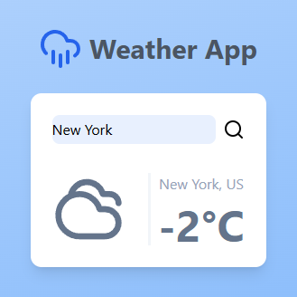

# Weather App

You can check the video of [me doing the project in live here](https://www.twitch.tv/videos/2343251176).

### Features

- **City Input**: Users can input the name of a city.
- **Display Temperature**: The app fetches and displays the current temperature of the city.
- **Temperature in Celsius**: Temperature is shown in Celsius.
- **Responsive Design**: The app is styled using Tailwind CSS for a clean and modern look, and it works well on different screen sizes.

### How to Use

1. **Input a City**: Type the name of a city into the input field.
2. **View Temperature**: The current temperature of the city will be displayed after fetching data from the OpenWeatherMap API.
3. **Responsive Interface**: The app will adjust to different screen sizes, ensuring a good user experience on both desktop and mobile devices.

### Technologies Used

- **HTML**: Structures the weather app interface.
- **CSS (Tailwind CSS)**: Provides modern and responsive styling for the app.
- **JavaScript**: Handles API requests, manages user input, and updates the DOM.
- **OpenWeatherMap API**: Used to fetch the current weather data.

### Installation

1. Clone the repository:
   ```bash
   git clone https://github.com/yourusername/weather-app.git
   ```

### Screenshots

<br>


---

# Aplicativo de Clima

### Funcionalidades

- **Entrada de Cidade**: Os usuários podem inserir o nome de uma cidade.
- **Exibição da Temperatura**: O aplicativo busca e exibe a temperatura atual da cidade.
- **Temperatura em Celsius**: A temperatura é mostrada em Celsius.
- **Design Responsivo**: O aplicativo é estilizado com Tailwind CSS para um visual moderno e limpo, e funciona bem em diferentes tamanhos de tela.

### Como Usar

1. **Inserir uma Cidade**: Digite o nome de uma cidade no campo de entrada.
2. **Ver Temperatura**: A temperatura atual da cidade será exibida após buscar os dados da API OpenWeatherMap.
3. **Interface Responsiva**: O aplicativo se ajusta a diferentes tamanhos de tela, garantindo uma boa experiência de usuário tanto em desktop quanto em dispositivos móveis.

### Tecnologias Utilizadas

- **HTML**: Estrutura a interface do aplicativo de clima.
- **CSS (Tailwind CSS)**: Fornece um estilo moderno e responsivo para o aplicativo.
- **JavaScript**: Lida com as requisições da API, gerencia a entrada do usuário e atualiza o DOM.
- **API OpenWeatherMap**: Utilizada para buscar os dados meteorológicos atuais.

### Instalação

1. Clone o repositório:
   ```bash
   git clone https://github.com/yourusername/weather-app.git
   ```
